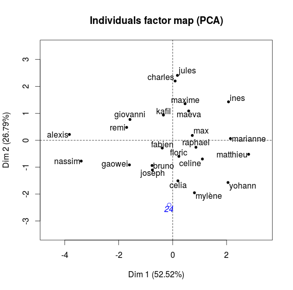

# Vitruvian proportions

A very light university assignement to check if the [Vitruvian man](https://www.wikiwand.com/en/Vitruvian_Man) proportions applied to our class. We began by measuring ourselves and computing the [principal components](http://www.wikiwand.com/en/Principal_component_analysis) of the said measures.

We then extracted clusters to see who ressembles each other and who was *perfect* according to Leonardo da Vinci.

Number 24 is both images is the hypothetical individual with perfect body ratios.